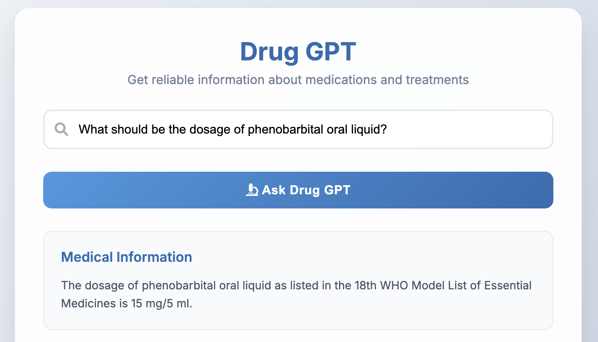
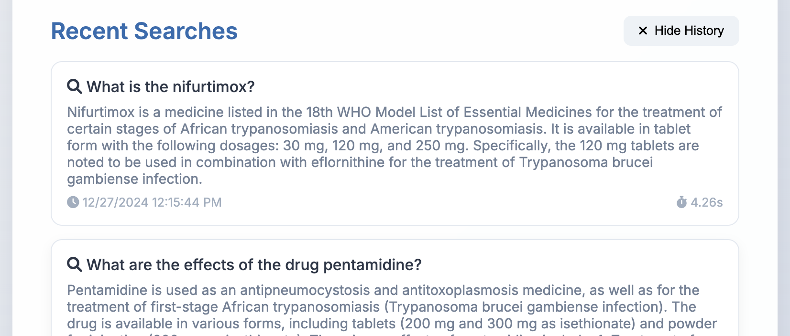
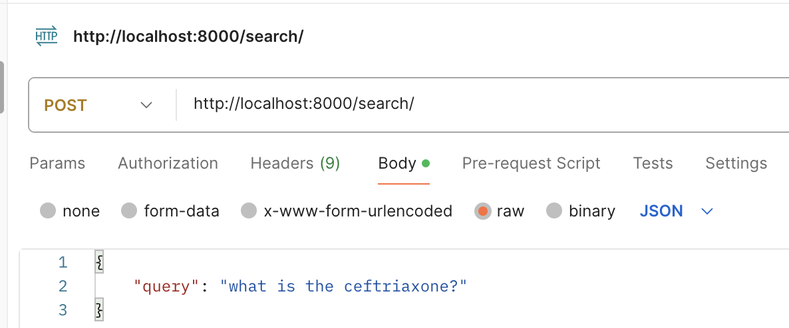
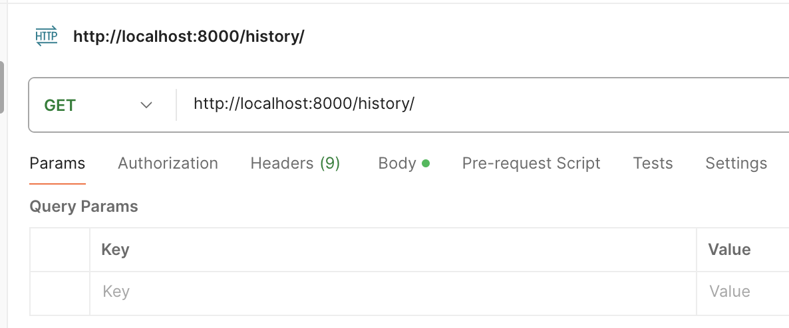

# RAG ChatBot Project

## Description

This project implements a Retrieval-Augmented Generation (RAG) chatbot designed to answer queries based on a specific dataset. It uses FastAPI as the web framework, PostgreSQL as the relational database, and Milvus as the vector database for efficient similarity searches. The application is containerized using Docker and includes comprehensive database migrations managed by Alembic.

---

## Project Demo

You can watch the project demo through the following link:

[Click here to watch the full demo](https://youtu.be/7iRSQH0HmsY)

---

## Use Cases

- **Medical Professionals**: Quick reference for drug information and potential interactions.
- **Pharmacists**: Verify medication details, dosage information, and combinations.
- **Medical Students**: A study tool to gain pharmaceutical knowledge efficiently.
- **Healthcare Administrators**: Easy access to medication information for accurate documentation.
- **Researchers**: Quick reference for medication properties and relevant studies.

---

# Medical Students & Researchers

<table style="width:100%; text-align:center;">
    <tr>
        <td style="text-align:center;">
            
            <p><strong>Medical Students & Researchers</strong></p>
            <p>Study tool for pharmaceutical knowledge and quick reference for medication properties and studies.</p>
        </td>
        <td style="text-align:center;">
            
            <p><strong>Researchers</strong></p>
            <p>You can list the last 10 records by default using the /history endpoint.</p>
        </td>
    </tr>

</table>

### Frontend Interface 🌐

The `index.html` file provides a user-friendly interface to interact with the backend services. You can customize it as needed, update the API endpoint with the port where your services are running, and start using it seamlessly.

---


<table style="width:100%; text-align:center;">
    <tr>
        <td style="text-align:center;">
            
        </td>
        <td style="text-align:center;">
            
        </td>
    </tr>

</table>

---

## Features

- **Retrieve and Generate Responses:** Leverages LangChain to retrieve relevant document chunks and generate human-like answers.
- **Milvus Integration:** Enables similarity-based document search.
- **PostgreSQL Database:** Logs requests and responses.
- **Flexible Middleware:** CORS enabled for cross-origin support.
- **Logging and Monitoring:** Detailed logs for debugging and performance analysis.

---

## Database Schema

The application uses a PostgreSQL database to log user queries and responses. Below is the schema for the `request_logs` table:

| Column Name   | Data Type | Description                            |
|---------------|-----------|----------------------------------------|
| `id`          | INTEGER   | Primary Key, Auto-incremented.         |
| `request`     | TEXT      | JSON representation of the request.    |
| `response`    | TEXT      | JSON representation of the response.   |
| `status_code` | INTEGER   | HTTP status code of the response.      |
| `duration`    | FLOAT     | Time taken to process the request.     |
| `log_level`   | TEXT      | Level of logging (e.g., INFO, ERROR).  |
| `created_date`| TIMESTAMP | Timestamp of the log entry creation.   |

---

## Prerequisites

Ensure you have the following installed:

- Python 3.9+
- Docker and Docker Compose
- PostgreSQL

---

## Installation and Setup

### 1. Clone the Repository
```bash
git clone https://github.com/rumeysacelik/RAG-Project.git
cd RAG-Project
```

### 2. Create a Python Virtual Environment
```bash
python3 -m venv fastapi-env
source fastapi-env/bin/activate
```

### 3. Install Dependencies
```bash
pip install -r requirements.txt
```

### 4. Set Up Environment Variables
Create a `.env` file in the root directory and define the following:
```env
DATABASE_URL=postgresql+psycopg2://<username>:<password>@localhost:5432/<db_name>
OPENAI_API_KEY=<your_openai_api_key>
MILVUS_URI=http://localhost:19530
FILEPATH=FILEPATH
CHUNK_SIZE=1000
CHUNK_OVERLAP=200
COLLECTION_NAME=collection_name
```

### 5. Set Up PostgreSQL
Create a PostgreSQL database and update the `DATABASE_URL` in the `.env` file.

### 6. Set Up Alembic for Database Migrations

- Initialize Alembic:
```bash
alembic init alembic
```
- Configure `alembic.ini` to point to your `DATABASE_URL`.
- Generate Migrations:
```bash
alembic revision --autogenerate -m "Initial migration"
```
- Apply Migrations:
```bash
alembic upgrade head
```

### 7. Start Milvus (Vector Database)
Using Docker Compose, start Milvus:
```bash
docker-compose up -d
```
Ensure Milvus is running by checking the logs:
```bash
docker logs milvus-standalone
```

### 8. Start the FastAPI Server
```bash
python app/main.py
```
The server will be available at `http://localhost:8000`.

---

## Usage

### Search Endpoint
- **URL:** `/search/`
- **Method:** `POST`
- **Payload:**
```json
{
    "query": "What is Ibuprofen?"
}
```
- **Response:**
```json
{
    "query": "What is Ibuprofen?",
    "answer": "Ibuprofen is listed in the WHO Model List of Essential Medicines (18th edition, April 2013) under the category of Non-opioids and non-steroidal anti-inflammatory medicines (NSAIMs). It is available in the following forms: Oral liquid: 200 mg/5 ml - Tablet: 200 mg; 400 mg; 600 mg It is noted that ibuprofen is not recommended for children less than 3 months old."
}
```
---

## Chat History Endpoint

- **URL:** `/history/`
- **Method:** `GET`
- **Description:** Retrieves the last 10  request logs stored in the database. 

---

## Project Structure

```
.
├── app
│   ├── config
│   │   ├── config.py       # Application configuration
│   ├── models
│   │   ├── model.py        # SQLAlchemy models
│   │   ├── schemas
│   │       ├── prompts.py  # Prompt templates
│   ├── routes
│   │   ├── api.py          # API route definitions
│   ├── services
│   │   ├── retrieval_chain.py  # LLM and retrieval logic
│   │   ├── vectorstore.py      # Milvus vector store integration
│   ├── main.py             # Entry point for the application
├── alembic                 # Database migrations
├── requirements.txt        # Python dependencies
├── Dockerfile              # Docker configuration
├── docker-compose.yml      # Milvus setup
└── README.md               # Project documentation
```

---

## Troubleshooting

### Common Issues

1. **Milvus Connection Error:**
   - Ensure Milvus is running and accessible at `http://localhost:19530`.

2. **Environment Variable Errors:**
   - Verify that the `.env` file is correctly configured.

3. **Database Migrations Fail:**
   - Check the `alembic.ini` configuration and ensure PostgreSQL is running.

